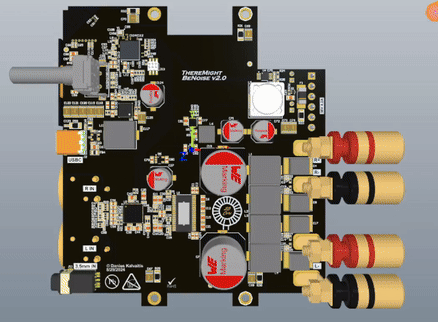
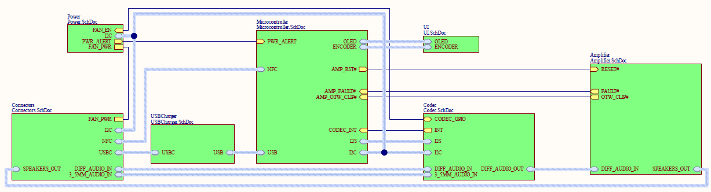

# ThereMightBeNoise
TPA3250 based Ultra-HD Class D audio amplifier that is small but packs a 70W stereo punch!

This repository contains the HW files. The main brain of this amplifier is nRF5340 (Dual-core Bluetooth 5.4 SoC from Nordic Semiconductor). Firmware for it is being developed at his repository over here [there_might_be_noise](https://github.com/DaniusKalv/there_might_be_noise).

## Top level block diagram

If you want to see a more detailed view, checkout the [schematic](ThereMightBeNoise_v2_0.pdf).

## Features

### Audio interfaces
- USBC connection supporting USB audio
- 3.5mm audio jack
- XLR differential audio
- Bluetooth

### Outputs
- 2 x 70W banana plugs for speakers

### User interface
- Rotary encoder with push button
- 128 X 64 pixel OLED display

### For convenience
- USBC charging